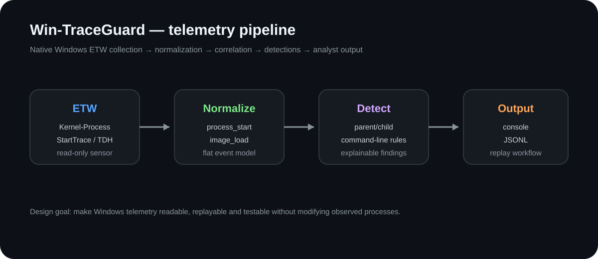
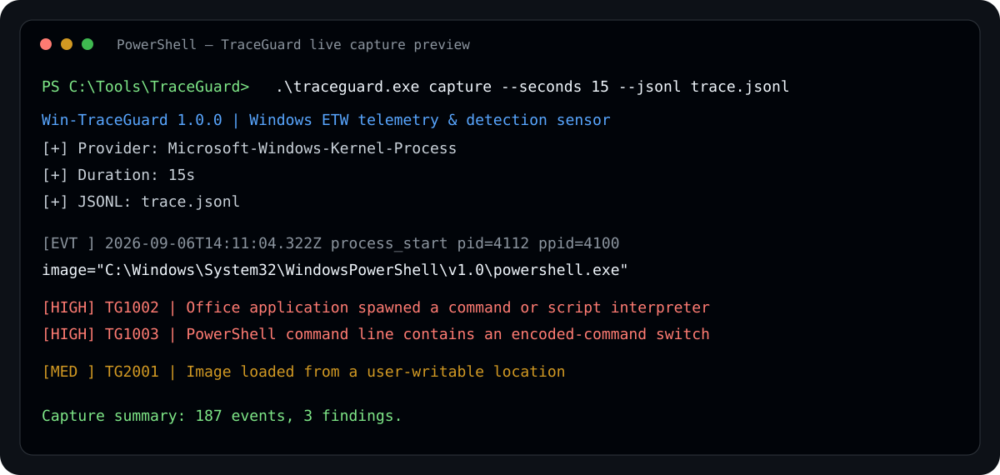
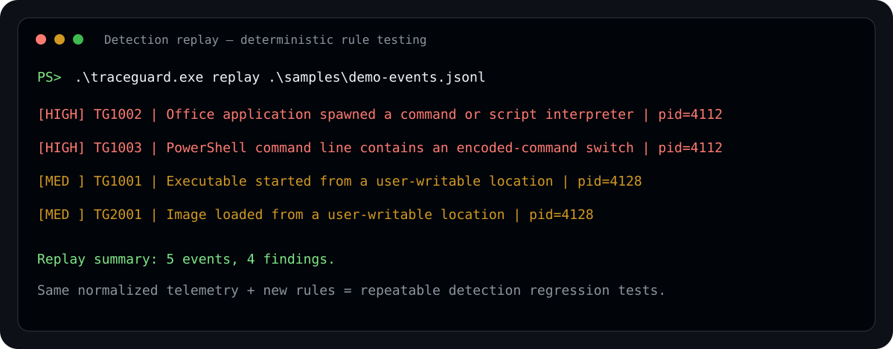
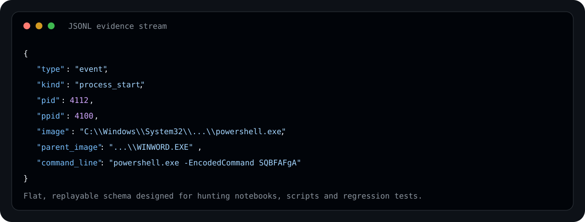

# Win-TraceGuard

<p align="center">
  <strong>Native Windows ETW telemetry & detection sensor written in C11 for endpoint research, hunting and detection engineering.</strong>
</p>

<p align="center">
  <a href="../../actions/workflows/ci.yml"></a>
  
  
  
  
  
</p>

Win-TraceGuard turns low-level Windows **Event Tracing for Windows (ETW)** process telemetry into a compact analyst workflow:

**collect → normalize → correlate → detect → record → replay**.

The executable is implemented in **ISO C11 + Win32/ETW/TDH APIs**. There is no C++ runtime, STL, Python runtime, service dependency, packet driver or third-party JSON library in the v1 executable.

TraceGuard is intentionally read-only. It does **not** inject into processes, modify remote memory, install persistence, steal credentials, exploit hosts, terminate processes or attempt to evade security controls. Its job is to observe endpoint behavior and explain why a sequence is interesting.



## Why this project exists

Endpoint-security examples often stop at one of two extremes: raw ETW metadata that is difficult to reason about, or a large framework where the collection and correlation mechanics disappear behind abstractions. TraceGuard sits in the middle.

The project demonstrates how a compact native Windows sensor can:

- create and consume a realtime ETW session;
- resolve a provider dynamically instead of hard-coding its GUID;
- decode selected properties through **Trace Data Helper (TDH)**;
- normalize OS-specific records into bounded C structures;
- correlate parent/child processes in memory;
- apply small, explainable detection rules;
- write a replayable JSONL evidence stream;
- regression-test the detection layer without requiring privileged ETW access in CI.

That makes the repository useful both as a security utility and as a readable Windows-internals / C systems-programming project.

---

## Why C11

TraceGuard deliberately uses C rather than hiding Win32 behind a higher-level abstraction layer.

The implementation exposes the engineering details that matter in native Windows telemetry work:

- explicit ownership of heap allocations used by TDH property buffers;
- fixed-capacity normalized event/finding fields;
- explicit initialization and cleanup functions;
- Win32 handles and trace-session lifecycle management;
- function-pointer callbacks instead of classes/lambdas;
- bounded JSON serialization and parsing;
- transient PID maps implemented with simple C structures;
- Win32 synchronization for the capture timeout thread.

The project therefore complements [`ProcSentinel-C`](https://github.com/Michel-DV/ProcSentinel-C): both are native C/WinAPI security projects, but one focuses on **snapshot triage** and the other on **telemetry over time**.

---

## Live capture preview

> The terminal graphics below are illustrative output previews built from the documented output contract. They are not presented as incident evidence from a real compromised host.



```powershell
traceguard.exe capture --seconds 30 --jsonl trace.jsonl
```

TraceGuard subscribes to `Microsoft-Windows-Kernel-Process`, normalizes supported process/image events, evaluates the rule engine, prints findings and optionally records both events and findings to JSONL.

Depending on local ETW policy, starting a realtime session can require an **elevated terminal** or equivalent trace-session permissions. TraceGuard reports the Windows error and exits; it does not attempt to bypass that policy.

---

## Detection replay

Replay is intentionally a first-class feature rather than a demo-only convenience.



```powershell
traceguard.exe replay .\samples\demo-events.jsonl
```

Normalized events can be replayed through the **current** rule engine. Rules can therefore be tuned and regression-tested against the same telemetry without reproducing a live event chain.

Machine-readable findings:

```powershell
traceguard.exe replay .\samples\demo-events.jsonl --json
```

---

## What TraceGuard collects

The ETW layer currently focuses on `Microsoft-Windows-Kernel-Process` and normalizes the following fields when they are exposed by the active Windows provider schema:

| Field | Purpose |
|---|---|
| `timestamp_utc` | UTC event timestamp |
| `kind` | `process_start`, `process_stop`, `image_load`, `other` |
| `pid` / `ppid` | process identity and ancestry correlation |
| `image` | process executable path/name |
| `parent_image` | transient enrichment from the PPID table |
| `command_line` | process command line when available |
| `loaded_image` | DLL/image path for image-load records |
| `event_id` / `opcode` | low-level ETW context |
| `provider` | normalized provider name |

ETW schemas can vary by Windows build and event version. Property decoding is deliberately tolerant: a missing field produces a partial normalized event instead of an unsafe read or crash.

### Bounded C event model

The normalized layer uses plain C structures with explicit field limits. For example, paths and commands are copied into bounded buffers rather than exposing TDH-owned memory to the rest of the program.

```c
typedef struct TgEvent {
    char timestamp_utc[TG_TIMESTAMP_CAP];
    TgEventKind kind;
    uint32_t pid;
    uint32_t ppid;
    uint16_t event_id;
    uint8_t opcode;
    char provider[TG_PROVIDER_CAP];
    char image[TG_PATH_CAP];
    char parent_image[TG_PATH_CAP];
    char command_line[TG_COMMAND_CAP];
    char loaded_image[TG_PATH_CAP];
} TgEvent;
```

The rule engine never needs to understand `EVENT_RECORD`, TDH descriptors or Win32 allocation rules.

---

## Built-in detections

The first rule set is intentionally compact. The goal is **correlation and explainability**, not maximum alert volume.

| Rule | Severity | Signal |
|---|---:|---|
| `TG1001` | Medium | executable starts from AppData, Temp, Downloads or `Users\Public` |
| `TG1002` | High | Office application spawns a command/script interpreter |
| `TG1003` | High | PowerShell command line contains an encoded-command switch |
| `TG1004` | High | `mshta.exe` launched with HTTP/HTTPS content |
| `TG1005` | High | `rundll32.exe` contains remote or script-like content |
| `TG1006` | Medium | Windows dual-use utility references a user-writable location |
| `TG2001` | Medium | image/DLL is loaded from a user-writable path |

A finding is **not a malware verdict**. Each rule produces a rationale explaining what matched and why an analyst may want to investigate it.

Detailed rule notes: [`docs/DETECTIONS.md`](docs/DETECTIONS.md).

---

## JSONL evidence stream



Example normalized event:

```json
{"type":"event","timestamp_utc":"2026-09-06T12:00:01.000Z","kind":"process_start","pid":4112,"ppid":4100,"event_id":1,"opcode":1,"provider":"Microsoft-Windows-Kernel-Process","image":"C:\\Windows\\System32\\WindowsPowerShell\\v1.0\\powershell.exe","parent_image":"C:\\Program Files\\Microsoft Office\\root\\Office16\\WINWORD.EXE","command_line":"powershell.exe -EncodedCommand SQBFAFgA","loaded_image":""}
```

Example finding:

```json
{"type":"finding","timestamp_utc":"2026-09-06T12:00:01.000Z","rule_id":"TG1003","severity":"high","title":"PowerShell command line contains an encoded-command switch","rationale":"Encoded PowerShell is not inherently malicious, but it reduces command-line transparency and is a strong triage signal when correlated with process ancestry.","pid":4112,"image":"C:\\Windows\\System32\\WindowsPowerShell\\v1.0\\powershell.exe"}
```

Serialization is implemented by the project itself with bounded output buffers. Replay parsing is deliberately narrow: it accepts the flat event contract TraceGuard emits rather than pretending to be a general-purpose JSON implementation.

See [`docs/OUTPUT.md`](docs/OUTPUT.md).

---

## Native ETW implementation

The realtime collector uses Windows tracing APIs directly:

```text
TdhEnumerateProviders
        |
        v
resolve Microsoft-Windows-Kernel-Process GUID
        |
        v
StartTraceW
        |
        v
EnableTraceEx2
        |
        v
OpenTraceW + ProcessTrace
        |
        v
EVENT_RECORD callback
        |
        v
TdhGetPropertySize / TdhGetProperty
        |
        v
bounded TgEvent
```

### Provider resolution

Instead of embedding a magic provider GUID, `TdhEnumerateProviders` is used to resolve `Microsoft-Windows-Kernel-Process` by name at runtime. Failure is reported explicitly.

### Property ownership

`TdhGetPropertySize` determines the size of a property. The collector places an upper bound on property allocation, allocates the buffer, calls `TdhGetProperty`, copies normalized values into the event structure and releases the temporary allocation.

### Text normalization

Provider properties may expose wide or narrow text depending on schema/version. The collector normalizes accepted text to UTF-8 before it crosses the ETW module boundary.

### Session lifecycle

The ETW session is represented by a `TgEtwSession` structure and explicit lifecycle functions:

```c
tg_etw_session_init(&session, callback, context);
tg_etw_session_start(&session, error, sizeof(error));
tg_etw_session_run(&session, error, sizeof(error));
tg_etw_session_stop(&session);
tg_etw_session_dispose(&session);
```

No constructor/destructor or RAII behavior is required; cleanup is visible in the control flow.

---

## Process ancestry correlation

Raw telemetry often provides PID/PPID values without a fully enriched process tree. TraceGuard keeps a transient bounded process-image table:

```text
PID 4100 -> WINWORD.EXE
PID 4112 -> powershell.exe
```

A later child event can therefore become:

```text
WINWORD.EXE
    └── powershell.exe
          ├── TG1002  Office -> script interpreter
          └── TG1003  encoded PowerShell
```

Process-stop events remove known entries. The state is in memory only and is not a hidden persistence mechanism or background database.

---

## Build

### Requirements

- Windows 10/11 or Windows Server with the ETW provider available;
- Visual Studio 2022+ / MSVC with native C build tools and Windows SDK;
- CMake 3.22+;
- x64 recommended.

### Configure and compile

```powershell
cmake -S . -B build -A x64 -DTRACEGUARD_BUILD_TESTS=ON
cmake --build build --config Release --parallel
```

CMake explicitly declares:

```cmake
project(WinTraceGuard VERSION 1.0.1 LANGUAGES C)
set(CMAKE_C_STANDARD 11)
set(CMAKE_C_STANDARD_REQUIRED ON)
set(CMAKE_C_EXTENSIONS OFF)
```

Binary:

```text
build\Release\traceguard.exe
```

Tests:

```powershell
ctest --test-dir build -C Release --output-on-failure
```

---

## CLI

```text
traceguard capture [--seconds N] [--jsonl path] [--quiet]
traceguard replay <events.jsonl> [--json]
traceguard providers
traceguard --version
```

Examples:

```powershell
# 15-second interactive capture
traceguard.exe capture --seconds 15

# Record normalized telemetry and findings
traceguard.exe capture --seconds 60 --jsonl .\out\endpoint.jsonl

# Suppress routine event lines while keeping findings
traceguard.exe capture --seconds 60 --quiet

# Replay the included safe synthetic dataset
traceguard.exe replay .\samples\demo-events.jsonl

# Emit machine-readable finding lines
traceguard.exe replay .\samples\demo-events.jsonl --json
```

Capture duration is bounded to **1–3600 seconds**.

---

## Safe synthetic regression dataset

`samples/demo-events.jsonl` is synthetic telemetry used by CI. It contains:

- a Word process;
- a PowerShell child with an encoded-command switch;
- an executable launched from Temp;
- an image load from Temp;
- a benign Notepad event.

It contains **no malware executable or payload**. The purpose is deterministic detection testing.

---

## Tests and CI

GitHub Actions builds and executes TraceGuard on a real Windows/MSVC x64 runner.

The pipeline performs:

1. **pure-C source audit** — fails if `.cpp`, `.cxx`, `.cc`, `.hpp` or `.hh` files are present;
2. CMake audit — verifies `LANGUAGES C` and `CMAKE_C_STANDARD 11` and rejects CXX configuration;
3. CMake configure;
4. Release compilation with MSVC;
5. CTest regression suite;
6. `--version` smoke test that must identify the C11 implementation;
7. provider configuration smoke test;
8. synthetic JSONL replay checking expected detection IDs.

Core tests cover all seven built-in rules, a benign control case, JSON escaping/round-trip behavior, PPID correlation and process-stop cleanup.

Hosted CI intentionally does not depend on starting a privileged realtime ETW session. The live collection module is separated from the deterministic normalization/detection/replay core so those pieces can be tested reliably on every commit.

---

## Repository layout

```text
Win-TraceGuard/
├── .github/workflows/ci.yml
├── include/traceguard/
│   ├── etw_session.h
│   ├── event.h
│   ├── jsonl.h
│   └── rule_engine.h
├── src/
│   ├── etw_session.c
│   ├── event.c
│   ├── jsonl.c
│   ├── main.c
│   └── rule_engine.c
├── tests/test_core.c
├── samples/demo-events.jsonl
├── docs/
│   ├── ARCHITECTURE.md
│   ├── DETECTIONS.md
│   ├── OUTPUT.md
│   ├── THREAT_MODEL.md
│   └── assets/
├── CMakeLists.txt
├── CHANGELOG.md
├── CONTRIBUTING.md
├── SECURITY.md
└── LICENSE
```

There are no C++ source or header files in the maintained implementation. CI enforces that property.

---

## Design principles

**Pure C11.** Native APIs are represented using structs, functions, bounded buffers and explicit ownership.

**Read-only by default.** The observed endpoint is never modified by a detection action.

**Normalize before detection.** ETW/TDH-specific parsing stays out of the rule engine.

**Explainable findings.** Every rule states what matched and why it matters.

**Replayable telemetry.** Detection changes can be tested without reproducing a live event chain.

**Graceful partial data.** Missing ETW properties are expected and handled.

**Bound allocations.** TDH property reads and normalized fields have explicit limits.

**No hidden network dependency.** v1 does not upload telemetry or query cloud reputation services.

---

## Limitations

TraceGuard is intentionally not an EDR replacement.

- ETW property availability varies across Windows versions/provider schemas;
- command lines can be absent depending on event version and system policy;
- parent-image enrichment only works for processes observed in the current session/replay stream;
- the transient PID table has a bounded capacity;
- PID reuse is handled through process-stop cleanup rather than a persistent process identity database;
- there is no kernel driver;
- there is no remote collection or central management;
- v1 does not correlate network telemetry;
- the JSON replay reader implements the documented flat TraceGuard event contract, not arbitrary JSON;
- rules are analyst-oriented heuristics rather than claims of compromise.

Those constraints are documented because defensive tooling should be explicit about what its telemetry can and cannot prove.

---

## Roadmap

Potential future defensive work:

- optional ETW network-provider correlation;
- richer process identity using start time + PID;
- signer/hash enrichment through a separate read-only C module;
- configurable data-driven detection rules;
- provider keyword/event filters;
- ETL-file offline replay;
- event-loss/performance counters;
- service and scheduled-task context;
- larger detection regression corpora;
- machine-readable exports for downstream detection tooling.

---

## Security model

TraceGuard is designed for authorized defensive research, endpoint visibility and detection engineering. See [`docs/THREAT_MODEL.md`](docs/THREAT_MODEL.md) and [`SECURITY.md`](SECURITY.md).

It does not provide process injection, remote-memory writes, persistence, credential access, exploitation, security-product disabling or stealth/evasion functionality.

---

## ProcSentinel-C + Win-TraceGuard

The two projects intentionally solve different endpoint-security problems:

```text
ProcSentinel-C
    └── snapshot / PE analysis / process & TCP state

Win-TraceGuard
    └── ETW stream / ancestry correlation / behavioral detections / replay
```

Together they demonstrate native Windows endpoint security using **C + WinAPI** from two complementary perspectives.

---

## License

MIT. See [`LICENSE`](LICENSE).
